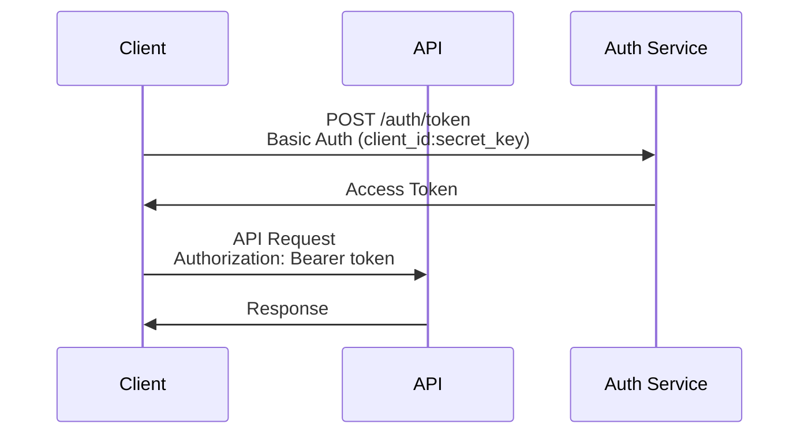
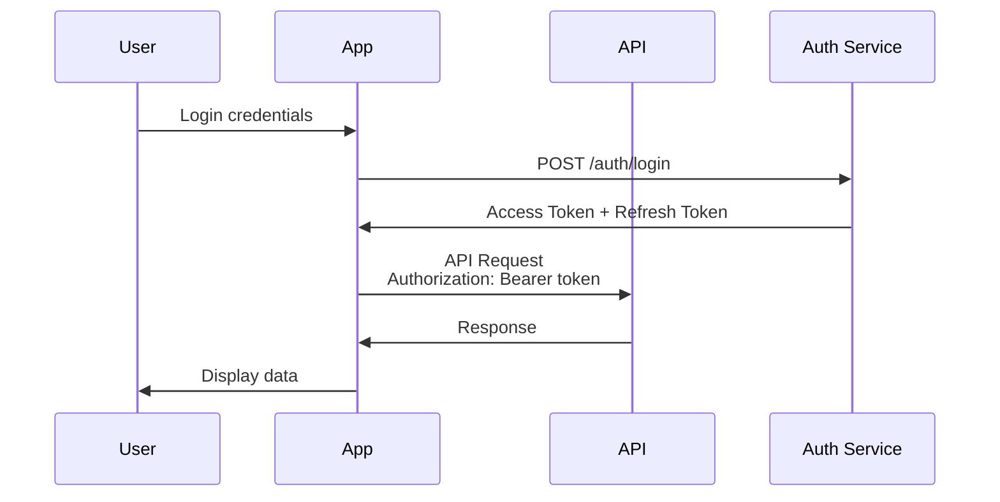

import { Card, CardGroup } from '@mintlify/components';
import { Callout } from '@mintlify/components';

# Authentication

Authentication is the foundation of secure API access in the Weir platform. This comprehensive guide covers all authentication methods, token management strategies, and security best practices.

## Authentication Methods Overview

The Weir API supports multiple authentication methods to accommodate different use cases and security requirements:

<CardGroup cols={2}>
  <Card
    title="API Key Authentication"
    icon="key"
    href="/v0.0.2/integration-guides/authentication/api-key"
  >
    For external integrations and third-party applications
  </Card>
  <Card
    title="Bearer Token Authentication"
    icon="shield"
    href="/v0.0.2/integration-guides/authentication/bearer-token"
  >
    For user-facing applications and web dashboards
  </Card>
  <Card
    title="Console Authentication"
    icon="monitor"
    href="/v0.0.2/integration-guides/authentication/console"
  >
    For internal console applications and admin tools
  </Card>
  <Card
    title="OAuth 2.0"
    icon="lock"
    href="/v0.0.2/integration-guides/authentication/oauth"
  >
    For third-party integrations and SSO
  </Card>
</CardGroup>

## Quick Start

### 1. API Key Authentication (External APIs)

For external integrations and third-party applications:

```bash
# Generate access token
curl -X POST "https://api-dev.weir.ai/auth/token" \
  -u "your-client-id:your-secret-key"
```

```javascript
// Use access token
const response = await fetch('https://api-dev.weir.ai/api/endpoint', {
  headers: {
    'Authorization': 'Bearer your-access-token'
  }
});
```

### 2. User Authentication (Console APIs)

For user-facing applications:

```javascript
// Login user
const loginResponse = await fetch('https://api-dev.weir.ai/auth/login', {
  method: 'POST',
  headers: {
    'Content-Type': 'application/json'
  },
  body: JSON.stringify({
    username: 'user@example.com',
    password: 'password123'
  })
});

const { data } = await loginResponse.json();
// Use data.accessToken for subsequent requests
```

## Authentication Flow Diagrams

### API Key Flow



### User Authentication Flow



## Token Management

### Access Tokens

Access tokens are short-lived tokens used for API authentication:

- **Lifetime**: 1 hour
- **Format**: JWT (JSON Web Token)
- **Usage**: Include in `Authorization: Bearer <token>` header

### Refresh Tokens

Refresh tokens are used to obtain new access tokens:

- **Lifetime**: 30 days
- **Format**: Opaque string
- **Usage**: Exchange for new access token when current one expires

### Token Refresh Flow

```javascript
class TokenManager {
  constructor() {
    this.accessToken = localStorage.getItem('access_token');
    this.refreshToken = localStorage.getItem('refresh_token');
  }
  
  async refreshAccessToken() {
    if (!this.refreshToken) {
      throw new Error('No refresh token available');
    }
    
    const response = await fetch('https://api-dev.weir.ai/auth/refresh/token', {
      method: 'POST',
      headers: {
        'Content-Type': 'application/json'
      },
      body: JSON.stringify({
        refreshToken: this.refreshToken
      })
    });
    
    if (!response.ok) {
      throw new Error('Token refresh failed');
    }
    
    const data = await response.json();
    this.accessToken = data.data.accessToken;
    this.refreshToken = data.data.refreshToken;
    
    // Update stored tokens
    localStorage.setItem('access_token', this.accessToken);
    localStorage.setItem('refresh_token', this.refreshToken);
    
    return this.accessToken;
  }
  
  async getValidToken() {
    if (!this.accessToken || this.isTokenExpired()) {
      await this.refreshAccessToken();
    }
    return this.accessToken;
  }
  
  isTokenExpired() {
    if (!this.accessToken) return true;
    
    try {
      const payload = JSON.parse(atob(this.accessToken.split('.')[1]));
      return Date.now() >= payload.exp * 1000;
    } catch (error) {
      return true;
    }
  }
}
```

## Security Best Practices

### 1. Secure Token Storage

**Browser Applications:**
```javascript
// Use sessionStorage for sensitive tokens
sessionStorage.setItem('access_token', token);

// Or use secure HTTP-only cookies (server-side)
res.cookie('access_token', token, {
  httpOnly: true,
  secure: true,
  sameSite: 'strict'
});
```

**Mobile Applications:**
```javascript
// Use secure storage
import { SecureStore } from 'expo-secure-store';

await SecureStore.setItemAsync('access_token', token);
```

**Server Applications:**
```javascript
// Use environment variables
const accessToken = process.env.WEIR_ACCESS_TOKEN;

// Or use secure key management services
const accessToken = await keyVault.getSecret('weir-access-token');
```

### 2. Token Rotation

Implement automatic token rotation:

```javascript
class SecureTokenManager {
  constructor() {
    this.refreshInterval = null;
    this.setupTokenRotation();
  }
  
  setupTokenRotation() {
    // Refresh token 5 minutes before expiry
    this.refreshInterval = setInterval(async () => {
      try {
        await this.refreshAccessToken();
      } catch (error) {
        console.error('Token refresh failed:', error);
        this.handleTokenRefreshFailure();
      }
    }, 55 * 60 * 1000); // 55 minutes
  }
  
  handleTokenRefreshFailure() {
    // Clear tokens and redirect to login
    this.clearTokens();
    window.location.href = '/login';
  }
  
  clearTokens() {
    this.accessToken = null;
    this.refreshToken = null;
    localStorage.removeItem('access_token');
    localStorage.removeItem('refresh_token');
  }
}
```

### 3. Request Interceptors

Implement request interceptors for automatic token management:

```javascript
class APIClient {
  constructor() {
    this.tokenManager = new TokenManager();
    this.setupInterceptors();
  }
  
  setupInterceptors() {
    // Request interceptor
    this.interceptors.request.use(async (config) => {
      const token = await this.tokenManager.getValidToken();
      config.headers.Authorization = `Bearer ${token}`;
      return config;
    });
    
    // Response interceptor
    this.interceptors.response.use(
      (response) => response,
      async (error) => {
        if (error.response?.status === 401) {
          try {
            await this.tokenManager.refreshAccessToken();
            // Retry original request
            return this.request(error.config);
          } catch (refreshError) {
            this.handleAuthenticationFailure();
          }
        }
        return Promise.reject(error);
      }
    );
  }
}
```

## Error Handling

### Authentication Errors

Handle authentication errors gracefully:

```javascript
class AuthenticationError extends Error {
  constructor(message, code, details) {
    super(message);
    this.name = 'AuthenticationError';
    this.code = code;
    this.details = details;
  }
}

async function handleAuthError(error) {
  switch (error.code) {
    case 'INVALID_CREDENTIALS':
      throw new AuthenticationError(
        'Invalid username or password',
        'INVALID_CREDENTIALS',
        'Please check your credentials and try again'
      );
    case 'TOKEN_EXPIRED':
      throw new AuthenticationError(
        'Token has expired',
        'TOKEN_EXPIRED',
        'Please refresh your token'
      );
    case 'INSUFFICIENT_PERMISSIONS':
      throw new AuthenticationError(
        'Insufficient permissions',
        'INSUFFICIENT_PERMISSIONS',
        'You do not have permission to access this resource'
      );
    default:
      throw new AuthenticationError(
        'Authentication failed',
        'AUTH_ERROR',
        error.message
      );
  }
}
```

## Multi-Environment Support

### Environment Configuration

```javascript
const config = {
  development: {
    baseUrl: 'https://api-dev.weir.ai',
    clientId: process.env.WEIR_DEV_CLIENT_ID,
    secretKey: process.env.WEIR_DEV_SECRET_KEY
  },
  staging: {
    baseUrl: 'https://api-staging.weir.ai',
    clientId: process.env.WEIR_STAGING_CLIENT_ID,
    secretKey: process.env.WEIR_STAGING_SECRET_KEY
  },
  production: {
    baseUrl: 'https://api.weir.ai',
    clientId: process.env.WEIR_PROD_CLIENT_ID,
    secretKey: process.env.WEIR_PROD_SECRET_KEY
  }
};

const environment = process.env.NODE_ENV || 'development';
export default config[environment];
```

### Environment-Specific Authentication

```javascript
class EnvironmentAwareAuth {
  constructor(environment) {
    this.config = config[environment];
    this.baseUrl = this.config.baseUrl;
  }
  
  async authenticate() {
    const response = await fetch(`${this.baseUrl}/auth/token`, {
      method: 'POST',
      headers: {
        'Authorization': 'Basic ' + btoa(`${this.config.clientId}:${this.config.secretKey}`)
      }
    });
    
    return response.json();
  }
}
```

## Testing Authentication

### Unit Tests

```javascript
describe('Authentication', () => {
  let tokenManager;
  
  beforeEach(() => {
    tokenManager = new TokenManager();
  });
  
  test('should refresh expired token', async () => {
    // Mock expired token
    tokenManager.accessToken = 'expired-token';
    
    // Mock refresh response
    global.fetch = jest.fn().mockResolvedValue({
      ok: true,
      json: () => Promise.resolve({
        success: true,
        data: {
          accessToken: 'new-token',
          refreshToken: 'new-refresh-token'
        }
      })
    });
    
    const newToken = await tokenManager.refreshAccessToken();
    expect(newToken).toBe('new-token');
  });
  
  test('should handle refresh failure', async () => {
    global.fetch = jest.fn().mockResolvedValue({
      ok: false,
      status: 401
    });
    
    await expect(tokenManager.refreshAccessToken()).rejects.toThrow();
  });
});
```

### Integration Tests

```javascript
describe('API Authentication', () => {
  test('should authenticate with valid credentials', async () => {
    const response = await fetch('https://api-dev.weir.ai/auth/token', {
      method: 'POST',
      headers: {
        'Authorization': 'Basic ' + btoa('test-client:test-secret')
      }
    });
    
    expect(response.ok).toBe(true);
    const data = await response.json();
    expect(data.success).toBe(true);
    expect(data.data.accessToken).toBeDefined();
  });
});
```

## Troubleshooting

### Common Issues

<Callout type="warning">
**Invalid Credentials**: Ensure your client ID and secret key are correct and haven't expired.
</Callout>

<Callout type="warning">
**Token Expired**: Implement automatic token refresh or handle token expiration gracefully.
</Callout>

<Callout type="warning">
**Rate Limited**: Implement exponential backoff and respect rate limits.
</Callout>

### Debug Mode

Enable debug mode for detailed authentication logs:

```javascript
class DebugTokenManager extends TokenManager {
  constructor(debug = false) {
    super();
    this.debug = debug;
  }
  
  async refreshAccessToken() {
    if (this.debug) {
      console.log('Refreshing access token...');
    }
    
    const result = await super.refreshAccessToken();
    
    if (this.debug) {
      console.log('Token refreshed successfully');
    }
    
    return result;
  }
}
```

## Next Steps

Continue learning about Weir API integration:

<CardGroup cols={2}>
  <Card
    title="Request Construction"
    icon="code"
    href="/v0.0.2/integration-guides/request-construction"
  >
    Learn how to construct effective API requests
  </Card>
  <Card
    title="Response Interpretation"
    icon="eye"
    href="/v0.0.2/integration-guides/response-interpretation"
  >
    Master response handling and error management
  </Card>
  <Card
    title="Best Practices"
    icon="star"
    href="/v0.0.2/integration-guides/best-practices"
  >
    Discover industry best practices for API integration
  </Card>
  <Card
    title="API Playground"
    icon="play"
    href="/v0.0.2/playground"
  >
    Test authentication methods in our interactive playground
  </Card>
</CardGroup>
